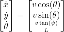

# Path-tracking MPC

This repository contains a path tracking MPC (Model Predictive Controller) for the [Polaris GEM e2 Simulator](https://gitlab.engr.illinois.edu/gemillins/POLARIS_GEM_e2/-/tree/main/). The controller relies on the odometry provided by an EKF from the package `robot_localization`, which is based solely on the car's IMU and GPS.

In addition to the controller, this repository contains some modified files from both the `gem_gazebo` and `gem_description` packages, from the original repository, which is in the package `gem_simulator_modified`. This modified version fixes a bug concerning the `frame_if` field of the LiDAR's point-cloud message that prevented the data from being visualized in Rviz. Moreover, it adapts some aspects that are important for the controller, such as having the `base_footprint` frame right below the `center_link` (in the middle of the car) instead of in the middle of the two rear wheels. However, other files and scripts from the original repository are still used. I tried to change as less as possible.

The code was developed in Ubuntu 20.04 with ROS Noetic.

**Author**: Lucas Lins Souza
**Contact**: lucaslinssouza@gmail.com

## The Implementation

### The MPC

The path-tracking MPC is based on the kinematic model of an Ackermann vehicle. Different from the simplest formulation of this model, which considers the reference point in the middle of the two rear wheels, the model used here considers it to be in the center of the car. This modification allows us to consider the robot as being a circle, which makes implementing obstacle avoidance a way easier and less expensive computationally.

The model uses the [x, y, theta] as states, theta being the orientation of the robot and [v, psi] as inputs, v being the robot's linear velocity, and psi the steering angle. The formulas are shown below.



The code was all developed in Python using [do-mpc](https://www.do-mpc.com/en/latest/index.html), a Python framework for prototyping and solving MPC problems. This framework uses [CasADi](https://web.casadi.org/docs/) under the hood to define and solve the problem, which contains efficient solvers that deal with highly non-linear optimization problems.

The objective function of the controller is the sum of the squared differences between each state and its setpoint value. This setpoint is updated constantly, which allows the robot to follow a path rather than just stabilize in a single point.

One of the main advantages of MPC is that it allows for setting constraints on the system. A constraint of 1.2 m/s (4.3 km/h) was applied to the robot's linear velocity, which limits its forward and backward motion. This limitation is important because the model does not consider the robot's mass and dynamic properties, so slowing it down brings its behavior closer to the model. Furthermore, a constraint of 0.78 rad (45°) was applied to the steering angle, to avoid surpassing the joint's limits.

To add obstacle avoidance, more constraints on the robot's position were added. Considering the circumscribed radius of the robot and the obstacle's radius, the distance from the robot's center (its x and y states) to the obstacle's center (x,y) must be bigger than the sum of both radii. Note that by considering the robot a circle, the theta state is irrelevant. The obstacles positions were acquired by the `/gazebo/model_states` topic. Since it is updated in runtime, this method works for both static and moving obstacles.

> A costmap version of the obstacle avoidance functionality is present in the branch `add/costmap_obs_avoidance`. It works, but it is yet computationally impractical. The control loop is taking 4 s for a 16 m^2 map with 0.5 m resolution.

### ROS Nodes

**TrackPathServer**

The MPC controller was implemented as a ROS node that contains an action server. When the server receives a goal with the path the robot must follow, it sets up the controller and runs the control loop until the robot reaches the final position of the path. As a return message, the server sends an array of path-tracking errors. 

Action servers:

* `track_path`: sets up the controller and controls the robot.

Subscribed topics:
    
* `/gazebo/model_states`: receive the obstacles' positions from gazebo.

Published topics:
    
* `ackermann_cmd`: publish the control inputs.
* `local_plan`: publish current motion prediction.

**TrackPathClient**

The client node simply imports the path points from a .csv file and sends it to the server. In the end, it plots the path-tracking error and saves the plot. 

Action clients:

* `track_path`: sends the path to the server.

Published topics:
    
* `path`: publish the path sent to the server.

## Install

Install system dependencies:

* [ROS Noetic](http://wiki.ros.org/noetic/Installation/Ubuntu) 

```sh
sudo apt install ros-noetic-ackermann-msgs ros-noetic-geometry2 \
    ros-noetic-hector-gazebo ros-noetic-hector-models ros-noetic-jsk-rviz-plugins \
    ros-noetic-ros-control ros-noetic-ros-controllers ros-noetic-velodyne-simulator \
    ros-noetic-robot-localization
```

Install python dependencies:

```sh
pip3 install numpy
pip3 install matplotlib
pip3 install do-mpc
```

In a catkin workspace, clone the original repo and this one:

```sh
git clone https://gitlab.engr.illinois.edu/gemillins/POLARIS_GEM_e2.git
git clone https://github.com/lucaslins0035/MPC_UGV.git
```

Build the workspace with `catkin_make`

### Installing with Docker

Alternatively, it is possible to use this simulation in a docker container. The Dockerfile included is based on a CUDA container, to allow better use of Gazebo and Rviz.

First install the [NVIDIA Container Toolkit](https://docs.nvidia.com/datacenter/cloud-native/container-toolkit/install-guide.html).

Then clone this repository and `cd` to its root folder.

Build the docker image:

```sh
docker build -t gem_path_tracking .
```

> This process takes several minutes because it installs all the dependencies including ROS Noetic desktop-full version.

Finally, create the container by running:

```sh
docker run --name gem_path_tracking --gpus all --network host --env=DISPLAY --env=NVIDIA_DRIVER_CAPABILITIES=all --env=NVIDIA-VISIBLE_DEVICES=all --env=QT_X11_NO_MITSHM=1 -v /tmp/.X11-unix:/tmp/.X11-unix:rw --runtime=nvidia --privileged -it test_gem_path_tracking:latest
```

## Running

To launch the simulation run:

```sh
roslaunch gem_simulator_modified gem_simulation.launch
```

To launch the controller server and client run:

```sh
roslaunch gem_path_tracking server_and_client.launch
```